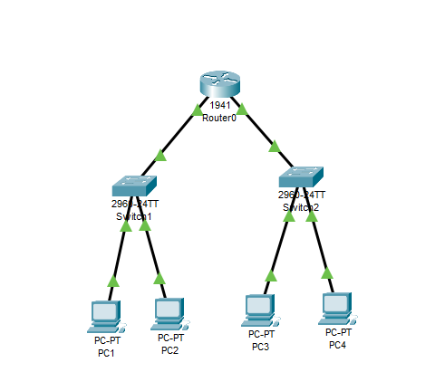

# Exercício V
## Sobre o projeto:
Esse projeto tem como objetivo simular um ambiente onde um roteador foi utilizado para ligar duas redes. 
## Exercício utilizado para a criação do projeto:
+ Switch 2960.
+ 1 Roteadores 1941
+ 2 Switchs 2960
+ 4 pcs 
+ Especifique os endereços dos hosts conforme o detalhamento abaixo:
+ **Rede 192.168.0.0:**
+ PC0 192.168.0.1 - 255.255.255.0
+ PC1 192.168.0.2 - 255.255.255.0
+ Rede 192.168.1.0
+ PC2 192.168.1.1 - 255.255.255.0
+ PC3 192.168.1.2 - 255.255.255.0
+ **Router0:**
+ Gigabit 0/0 192.168.0.254 - 255.255.255.0
+ Gigabit 0/1 192.168.1.254 - 255.255.255.0
+ **Rede 192.168.0.0:**
+ PC0 192.168.0.1 - 255.255.255.0 - Gateway - 192.168.0.254
+ PC1 192.168.0.2 - 255.255.255.0 - Gateway - 192.168.0.254
+ **Rede 192.168.1.0:**
+ PC2 192.168.1.1 - 255.255.255.0 - Gateway - 192.168.1.254
+ PC3 192.168.1.2 - 255.255.255.0 - Gateway - 192.168.1.254
## Tecnologias utilizadas:
O projeto utiliza o Cisco Packet Tracer. 

## Principais funcionalidades:
Simular um ambiente onde um roteador conecta duas redes. \
!

